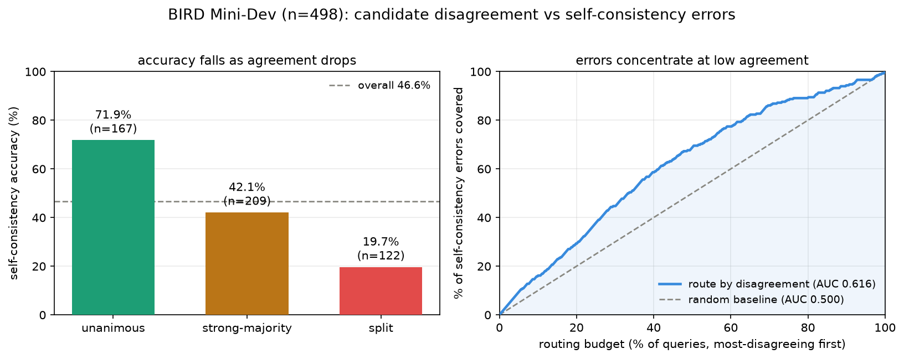

# Candidate disagreement as a difficulty signal for verification routing in text-to-SQL

> **A preliminary feasibility study — not a finished system.** This repo tests a single
> premise — *does candidate disagreement predict self-consistency selection errors?* — on
> one model and one benchmark. It does **not** build or evaluate a router, and it does
> **not** improve text-to-SQL accuracy. It validates an assumption that a future router
> would depend on.

## Motivation

LLM text-to-SQL systems often follow a **generate-then-select** recipe: sample several
candidate SQL queries, then pick one. This probe sits at the intersection of three ideas:

- **Alpha-SQL** — generates candidates (MCTS) and selects by **self-consistency** (a
  majority vote over execution results).
- **DPC** — adds an expensive multi-agent **verification** step to catch errors that
  selection misses.
- **EllieSQL** — routes the **generation** stage by predicted question complexity, spending
  more compute only on hard questions.

Heavy verification (DPC-style) is costly to run on every question. The idea behind this
study: **route the verification step by difficulty** — send only the "hard" questions to
expensive verification — and use **candidate disagreement** (cheap, and already computed
during self-consistency selection) as the difficulty signal.

That only works if disagreement actually tracks where selection goes wrong. This study
checks exactly that, before any router is built.

## Research question

> When candidate SQLs **disagree** (their execution results scatter into many clusters), is
> the self-consistency choice **more likely to be wrong**? If so, routing expensive
> verification to the most-disagreeing questions is justified.

## Method

Benchmark: **BIRD Mini-Dev** — 500 SQLite questions over 11 databases (the official curated
subset of BIRD-dev).

Per question:

1. Generate **K = 8** candidate SQLs with **Qwen2.5-Coder-7B** via **Ollama**, temperature
   **0.7**, each candidate sampled with a distinct seed (`seed = 42 + i`) so candidates are
   diverse yet reproducible. Prompt = database schema (DDL) + question + BIRD evidence hint.
2. Execute every candidate and the gold SQL (read-only SQLite, with a timeout).
3. **Cluster** candidates by execution result — an order-insensitive multiset of rows with
   numeric normalization (so `1` and `1.0` match). Candidates that fail to execute are
   excluded from result clusters but still counted in the `K` denominator, so "all
   candidates crashed" reads as low agreement, not consensus.
4. **agreement = size of largest cluster / K.** The **self-consistency prediction** is a
   candidate from the largest cluster; it is **correct** if its result matches gold.
   **Pass@K** (oracle upper bound) = *any* candidate matches gold.
5. Bucket questions: **unanimous** (agreement = 1.0), **strong-majority**
   (0.5 ≤ agreement < 1.0), **split** (agreement < 0.5).

Analysis (`analyze.py`):

- **Routing curve** — sort questions by ascending agreement (most-disagreeing first) and
  plot the cumulative share of self-consistency errors covered as the routing budget grows
  0 → 100%. **AUC** summarizes concentration (0.5 = errors spread randomly; higher = errors
  concentrated at low agreement).
- **Crash vs result-disagreement separation** — recompute agreement over *only*
  successfully-executing candidates (`agreement_exec = largest cluster / #successful`, on an
  executable-only subset) to confirm the signal is genuine result-disagreement and not just
  execution failures; plus a crash-rate-only analysis.

## Results

All numbers are read from `analysis_full.json` (full run) and `analysis_smoke.json`
(50-question smoke). Generation: Qwen2.5-Coder-7B, K = 8, temp 0.7, seed 42.



**Headline** (n = 498 valid; 2 of 500 gold queries failed to execute and were excluded):

| metric | value |
| --- | --- |
| Self-consistency accuracy | 46.6% (232/498) |
| Pass@K (oracle upper bound) | 57.4% (286/498) |
| Generation–selection gap | 10.8% |
| Mean distinct SQL / question | 4.88 of 8 |

**Accuracy by agreement bucket** — self-consistency accuracy falls monotonically as
agreement drops, and errors concentrate in the low-agreement buckets:

| bucket | n (share) | SC accuracy | share of all errors |
| --- | --- | --- | --- |
| unanimous (a = 1.0) | 167 (33.5%) | 71.9% | 17.7% |
| strong-majority (0.5 ≤ a < 1.0) | 209 (42.0%) | 42.1% | 45.5% |
| split (a < 0.5) | 122 (24.5%) | 19.7% | 36.8% |

**Routing curve** — routing the most-disagreeing questions first covers errors faster than
random: **AUC 0.616** (vs 0.500). The most-disagreeing 50% of questions contain ~69% of all
selection errors.

**Crash vs genuine result-disagreement** (executable-only subset, n = 470; 20 all-crash +
8 single-success excluded):

- Result-disagreement alone still predicts errors: **AUC 0.607**.
- Crash rate alone also predicts, but more weakly: **AUC 0.585** (mean crash rate 9.6% for
  correct vs 24.7% for incorrect selections).
- The combined `agreement = largest / K` (0.616) is the strongest single signal, because it
  captures both failure modes.

**Confident-but-wrong ceiling** — **28.1%** of unanimous questions are still wrong. These
account for **17.7% of all errors** and carry no disagreement signal, so a disagreement-based
router structurally cannot flag them.

**Smoke (n = 50) → full (n = 498)** — the signal held and sharpened with scale: routing AUC
0.591 → 0.616; result-disagreement-only AUC 0.592 → 0.607.

**Interpretation.** Candidate disagreement is a usable, near-free difficulty signal —
self-consistency errors concentrate where candidates disagree — which **supports** the
premise behind verification routing. The signal is modest (AUC ≈ 0.62), and ~18% of errors
are confident-but-wrong and beyond its reach. No router is built or evaluated here.

## How to run

Prerequisites: Python 3.10+, and [Ollama](https://ollama.com/) running with the model pulled:

```bash
ollama pull qwen2.5-coder:7b
```

Install:

```bash
python3 -m venv venv && source venv/bin/activate
pip install -r requirements.txt
```

Data (not committed — download separately):

- **BIRD dev databases** — from the [BIRD benchmark](https://bird-bench.github.io/). Extract
  so each database is at `databases/<db_id>/<db_id>.sqlite` (11 databases).
- **BIRD Mini-Dev questions** — `mini_dev_sqlite.json` from the
  [`birdsql/bird_mini_dev`](https://huggingface.co/datasets/birdsql/bird_mini_dev) dataset
  (file `data/mini_dev_sqlite-00000-of-00001.json`); save it at the repo root as
  `mini_dev_sqlite.json`. The SQLite Mini-Dev reuses the BIRD dev databases.

Run generation (writes `results.json`):

```bash
python main.py
# quick smoke first (seeded 50-question sample, separate output):
SUBSET_N=50 RESULTS_PATH=results_smoke.json python main.py
# macOS: prefix long runs with `caffeinate -dimsu` so system sleep doesn't stall Ollama
```

Analyze (reads saved results — no regeneration; prints both the agreement analysis and the
crash-separated analysis, and writes `analysis.json` + `routing_curve.csv`):

```bash
python analyze.py results.json
python analyze.py results.json --show-candidates 5   # inspect the most-disagreeing queries
```

Regenerate the figure (needs matplotlib — a figure-only dependency, not required to run the
pipeline):

```bash
pip install matplotlib
python make_figure.py
```

Configuration (env vars or a `.env` file; see `config.py`): `LLM_MODEL`, `NUM_CANDIDATES`
(K), `GENERATION_TEMPERATURE`, `GENERATION_SEED`, `SUBSET_N`, `MAX_WORKERS`,
`OLLAMA_BASE_URL`.

## Limitations

- **Single model** — one 7B local model (Qwen2.5-Coder-7B). The signal may change with
  stronger models that agree more often.
- **Single benchmark, modest size** — BIRD Mini-Dev only (n ≈ 498). No cross-benchmark or
  cross-domain check.
- **Modest signal** — routing AUC ≈ 0.62: clearly above random, but far from a clean
  separator.
- **Confident-but-wrong floor** — ~18% of errors occur on unanimous questions; disagreement
  cannot flag them, capping a disagreement-only router near ~82% error recall.
- **No router** — this study measures a signal. It does **not** implement, tune, or evaluate
  a verification router, and reports **no** end-to-end accuracy improvement.
- **Deliberately lean generator prompt** — schema DDL + evidence only (no column
  descriptions or sample rows), so absolute accuracy is below tuned BIRD systems. That is
  fine for studying the correlation, but the accuracy numbers here are not a SOTA claim.

## Future work

- Build the actual **uncertainty-aware verification router**: use combined
  `agreement = largest / K` as the difficulty signal to send only low-agreement questions to
  expensive (DPC-style) verification, and measure the accuracy/cost trade-off end to end.
- Handle the **confident-but-wrong** cases disagreement misses (e.g., a complementary
  verification trigger that does not rely on disagreement).
- Test **stronger models and more benchmarks** (e.g. Spider, full BIRD-dev) to see whether
  the signal holds, strengthens, or compresses.

## Repository structure

```
config.py              settings (model, K, temperature, seed, paths)
db_manager.py          read-only SQLite execution with timeout
llm_client.py          Ollama client (per-candidate seed, retries)
pipeline.py            generation -> execution clustering -> agreement / metrics
main.py                entry point (runs the pipeline -> results.json)
analyze.py             both analyses + routing curve / AUC (reads results.json)
make_figure.py         regenerate figures/routing_results.png from the artifacts
requirements.txt       pipeline runtime dependencies
results.json           raw per-question results (committed; reusable for re-analysis)
analysis_full.json     computed metrics, full run
analysis_smoke.json    computed metrics, 50-question smoke
routing_curve_full.csv
routing_curve_smoke.csv  error-coverage-vs-budget curves
figures/               results figure
```

Large inputs (BIRD `databases/`, `mini_dev_sqlite.json`) and run state (`venv/`, logs,
`checkpoints_*/`) are gitignored — see [How to run](#how-to-run) to obtain the data.

## Prior work referenced

- **BIRD** — the text-to-SQL benchmark used here ([bird-bench.github.io](https://bird-bench.github.io/)).
- **Alpha-SQL** — candidate generation (MCTS) + self-consistency selection.
- **DPC** — expensive multi-agent verification of selected SQL.
- **EllieSQL** — complexity-aware routing of the generation stage.

This probe combines their ideas: route the *verification* stage (DPC-style) by difficulty
(EllieSQL-style), using self-consistency disagreement (Alpha-SQL-style) as the signal.

## Data & license

BIRD data is distributed under its own license (CC BY-SA 4.0); see the BIRD benchmark for
terms. The code here is a research probe — add a license of your choice before distributing.
